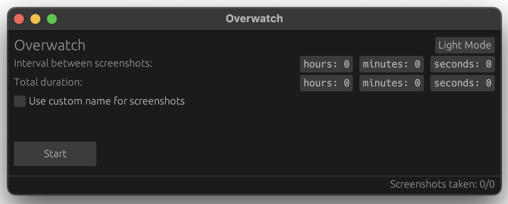

# Overwatch

**Overwatch** is a lightweight, open-source screenshot tool built in **Rust**. Inspired by Apple’s Rewind, **Overwatch** offers efficient, customizable screenshot capturing with high performance and a minimal footprint. Whether you're monitoring multiple displays, creating automated screen capture routines, or looking for a highly customizable tool, Overwatch has you covered.

## Features

- **Cross-Platform Compatibility**: Runs on **macOS**, **Linux**, and **Windows** with support for multi-display environments.
- **Customizable Capture Intervals**: Set your own intervals between screenshots (in hours, minutes, and seconds).
- **Flexible Duration Control**: Configure how long the screenshot process should run, from a few seconds to hours or even days.
- **Dark Mode / Light Mode**: Overwatch offers both **dark mode** and **light mode** for an optimal user experience.
- **Custom Filename Options**: Automatically timestamp screenshots, or define your own custom filenames for each capture session.
- **Placeholder in Custom Name Field**: If you choose to use a custom name for your screenshots, a **placeholder** will guide you until a name is entered.
- **Real-Time Screenshot Count**: Track how many screenshots have been taken during a session and how many are expected.
- **Start Button**: Centrally placed for easy interaction.
- **Open-Source**: Fully open-source and written in **Rust**, benefiting from Rust’s memory safety and performance.

## How It Works

**Overwatch** is designed to be easy to use while providing full flexibility and control over your screenshot workflow. The tool allows users to configure the following options:

- **Interval**: Set how often the screenshots should be taken (in hours, minutes, and seconds).
- **Duration**: Define the total runtime of the screenshot session.
- **Custom or Auto-Naming**: Choose between timestamp-based filenames or custom names for each session. Placeholder text appears if no custom name is provided.
- **Dark/Light Mode Toggle**: Switch between a user-friendly light or dark theme.
- **Screenshot Count**: View the number of screenshots taken during the session.

## Screenshots

### Light Mode


### Dark Mode



## Installation

### Prerequisites

Ensure that you have **Rust** installed on your machine. If not, you can install it by following the instructions at [Rust's official website](https://www.rust-lang.org/tools/install).

### Clone the Repository

```bash
git clone https://github.com/beaux-riel/overwatch.git
cd overwatch
```

### Build the Project

To build the project, run:

```bash
cargo build --release
```

### Run the Application

To launch **Overwatch**, use the following command:

```bash
cargo run
```

## Usage

Once the application is running, the GUI allows you to:

1. Set the **interval** between screenshots.
2. Specify the **total duration** for the screenshot session.
3. Optionally, set a **custom name** for the screenshots (with a placeholder if the field is empty).
4. Toggle between **light** and **dark mode**.
5. Monitor how many screenshots have been taken during a session, and how many are expected.

### Example Use Case

If you want to capture a screenshot every 10 seconds for 2 minutes with a custom name `session1`:

1. Set **Interval** to `0 hours, 0 minutes, 10 seconds`.
2. Set **Duration** to `0 hours, 2 minutes, 0 seconds`.
3. Toggle the "Custom name" checkbox and type in `session1` (or use the placeholder to guide you).
4. Click the **Start** button, and Overwatch will capture and save 12 screenshots over the 2-minute period.

## Contributing

We welcome contributions! If you’d like to contribute to **Overwatch**, here’s how you can help:

1. Fork the repository.
2. Create your feature branch: `git checkout -b feature-name`.
3. Commit your changes: `git commit -m 'Add some feature'`.
4. Push to the branch: `git push origin feature-name`.
5. Open a pull request.

## License

This project is licensed under the MIT License - see the [LICENSE](LICENSE) file for details.

## Acknowledgments

- Inspired by **Apple Rewind** for its clean, simple screenshot capture experience.
- Built with **Rust** for performance and memory safety.